<p align="center">
  <h2 align="center">TabPFN-3.5 as a Behavior-Cloned Policy for Control</h2>
  <p align="center">
    <a href="https://github.com/jrzmnt">Juarez Monteiro</a><sup>1</sup>
    .
    <a href="https://github.com/Clalloures">Clarissa Lima</a><sup>1</sup>
    .
    <a href="https://github.com/lpfgarcia">Luís Paulo</a><sup>1</sup>
    .
    <a href="https://github.com/franciscogaluppo">Francisco Galuppo</a><sup>1</sup>
  </p>
  <p align="center"><strong>Prior Labs TabPFN-3.5 Hackathon, 2026</strong></p>
  <p align="center">
    <sup>1</sup>Instituto Kunumi
  </p>
  <h3 align="center">

 [](https://priorlabs.ai)
 [](https://platform.priorlabs.ai/hackathon-3.5)
 [](pyproject.toml)
 [](LICENSE)
 [](https://youtu.be/lkEG4GceMvE)
 <div align="center"></div>
</p>

<p align="center">
  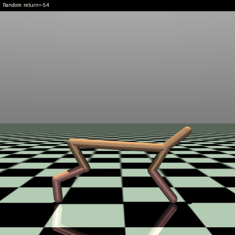
  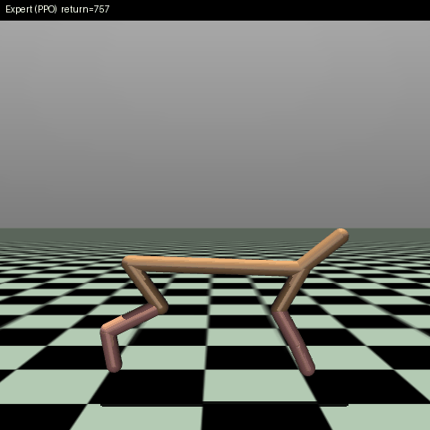
  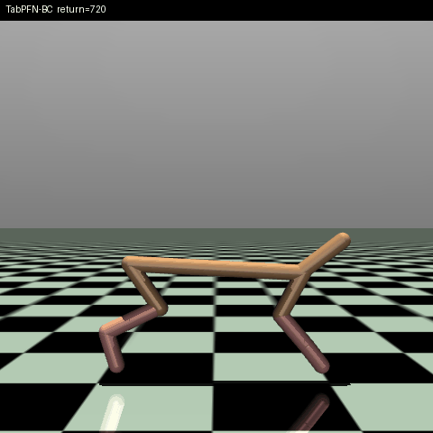
</p>
<p align="center"><sub>HalfCheetah: Random, Expert (PPO), TabPFN-3.5 (in-context, no training)</sub></p>

## Abstract

Can [TabPFN-3.5](https://priorlabs.ai), a tabular foundation model that fits
through in-context learning instead of a gradient-based training loop, work as
the policy of a control task? We give it an expert's `(state, action)`
demonstrations as context and let it predict the action for each new state.
We compare the result against the expert and a random baseline on six MuJoCo
environments and four Atari games.

TabPFN is normally used for static tabular prediction. Here its prediction is
the action the agent takes at every step of a closed loop, with no reward
function, no gradient updates and no RL training.

Main points:

- The policy is a single `.fit()` on demonstrations. With new data you replace the context, which takes seconds, instead of retraining for hours.
- Only `(state, action)` pairs are needed, no reward function. That helps when a reward is hard to design or exploration is unsafe.
- MuJoCo's continuous actions use `TabPFNRegressor`, and Atari's discrete actions use `TabPFNClassifier`.
- Returns are measured in a closed loop over 20 parallel episodes, and we report the case that failed (Breakout) along with the ones that worked.

## TL;DR

- **In-context cloning works almost perfectly when the action space is
  small**: InvertedPendulum, Pong, Ms. Pac-Man all hit an exact
  mean-return match with the expert; Hopper and Space Invaders land at
  ~97-99.8%. No gradient-based training, just `.fit()` on demonstrations.
- **It degrades as dimensionality grows**: HalfCheetah (6-dim actions)
  drops to ~83%; HumanoidStandup (17-dim actions, 348-dim observations)
  breaks down to R²≈0.34 offline and wasn't worth evaluating in closed
  loop.
- **The most interesting finding came from testing rigor, not a clean
  win**: Breakout looked like a fourth near-success at a 100-step
  horizon (~80%), until we ran a real full episode and it collapsed to
  ~7%, despite having the *highest* offline action-prediction accuracy of
  the four Atari games. That's the textbook signature of **compounding
  error** in behavior cloning.
- **That hypothesis doesn't generalize blindly, though.** HalfCheetah
  (also 6-dim actions) run out to a full 1,000-step episode reached
  **87.0%**, *better* than its 200-step number, not worse. Compounding
  error is real in Breakout, not decisive in HalfCheetah.
- Full numbers in [Results](#results); the complete story on every
  environment (including why `ant` and `walker2d` are asterisked) is in
  [`docs/DETAILS.md`](docs/DETAILS.md).

<details open="open" style='padding: 10px; border-radius:5px 30px 30px 5px; border-style: solid; border-width: 1px;'>
  <summary>Table of Contents</summary>
  <ol>
    <li><a href="#tldr">TL;DR</a></li>
    <li><a href="#why-tabpfn-35">Why TabPFN-3.5</a></li>
    <li><a href="#why-this-matters">Why this matters</a></li>
    <li><a href="#installation">Installation</a></li>
    <li><a href="#data">Data</a></li>
    <li><a href="#results">Results</a></li>
    <li><a href="#demo">Demo</a></li>
    <li><a href="#running-the-experiments">Running the experiments</a></li>
    <li><a href="#limitations-and-next-steps">Limitations and next steps</a></li>
    <li><a href="#related-work-and-where-it-points-next">Related work</a></li>
    <li><a href="#acknowledgements">Acknowledgements</a></li>
    <li><a href="#citation">Citation</a></li>
  </ol>
</details>

More detail (pipeline internals, every script, the latency investigation, the
story of each environment) is in [`docs/DETAILS.md`](docs/DETAILS.md).

## Why TabPFN-3.5

The project uses features that are new in 3.5
([changelog](https://docs.priorlabs.ai/changelog/tabpfn-3.5)):

- The multitask checkpoint covers classification and regression, and we use both: `TabPFNRegressor` for MuJoCo and `TabPFNClassifier` for Atari. It is the same in-context `.fit()` for two different kinds of control problem.
- The feature limit went from about 2,000 to up to 20,000. Atari states are 512-dim CNN embeddings, and HumanoidStandup observations are 348-dim.
- The Fast checkpoint (`ModelVersion.V3_5_FAST`, up to 6x faster) is what every script uses. It is what makes a `.fit()`-based policy fast enough for closed-loop rollouts.

```
PPO expert (Hugging Face Hub)
        |  rollout, log (state, action) pairs
        v
data/demos_<env>.npz
        |  subsample context
        v
TabPFN-3.5 Fast   .fit(states_context, actions_context)   <- in-context, no gradients
        |
        v
policy(obs) = TabPFN.predict(obs)  ->  closed-loop rollout vs. expert and random
```

## Why this matters

If the expert already runs, there's no practical reason to swap it in for
*this exact task*: the point is elsewhere:

1. **A capability test, and a deliberately unusual use of TabPFN.**
   TabPFN's usual home is static tabular prediction: dataset in,
   prediction out. Here the "dataset" is a stream of `(state, action)`
   pairs, and TabPFN's prediction *is* the next action taken, every step,
   in real time, with no reward function, no gradient updates, no RL loop.
2. **No retraining when the data changes.** New demonstrations don't
   require retraining a network: just swap the context and TabPFN
   adapts immediately (seconds, via `.fit()`), instead of the hours of RL
   training that produced the expert.
3. **No reward function required.** RL needs one, and in a lot of real
   settings (a proprietary controller you can only observe, human
   teleoperation logs, a robot where trial-and-error exploration is
   unsafe) designing a good reward is the actual bottleneck. Behavior
   cloning only needs example `(state, action)` pairs.

## Installation

Requires [`uv`](https://docs.astral.sh/uv/) and Python 3.12+. We developed and ran this on macOS (Apple Silicon).

```bash
git clone https://github.com/jrzmnt/tabpfn-hackathon.git
cd tabpfn-hackathon
uv sync
```

TabPFN-3.5 needs a one-time license acceptance before it downloads weights:

1. Log in at [ux.priorlabs.ai](https://ux.priorlabs.ai) and accept the license under the Licenses tab.
2. Copy your API key from [ux.priorlabs.ai/account](https://ux.priorlabs.ai/account).
3. Put it in a local `.env` file (git-ignored):

```bash
echo 'TABPFN_TOKEN=your-api-key-here' > .env
```

## Data

The experts are pretrained PPO/SAC agents downloaded from the Hugging Face Hub
(the [`sb3`](https://huggingface.co/sb3) and
[`farama-minari`](https://huggingface.co/farama-minari) organizations) with
`huggingface_sb3` and run with `stable-baselines3`. We did not train them. The demonstrations for
`invertedpendulum`, `halfcheetah`, `hopper` and `swimmer` are committed under
`data/` (`demos_<env>.npz`, 20,000 transitions each), so the main results run
without collecting anything. The rest can be regenerated:

```bash
uv run python scripts/collect_demos.py --env halfcheetah     # MuJoCo
uv run python scripts/collect_atari_demos.py --env pong      # Atari, about 225MB, not committed
```

| Environment | Obs dims | Action dims |
| ----------- | -------- | ----------- |
| invertedpendulum | 4 | 1 |
| swimmer | 8 | 2 |
| hopper | 11 | 3 |
| halfcheetah | 17 | 6 |
| humanoidstandup | 348 | 17 |
| pong, breakout, spaceinvaders, mspacman | 512 (CNN embedding) | 4 to 9, discrete |

A frame-stacked Atari observation has 28,224 dimensions. Instead of raw
pixels, TabPFN gets the expert's own frozen CNN feature-extractor output
(512-dim).

## Results

Mean return over 20 parallel episodes, TabPFN-BC compared with the expert that
produced its context.

### MuJoCo (continuous actions, ordered by action-space size)

| Env | Action dims | Offline R² | TabPFN-BC / Expert |
| --- | --- | --- | --- |
| invertedpendulum | 1 | 0.990 | 100% |
| swimmer | 2 | 0.997 | ~99% |
| hopper | 3 | 0.998 | ~99.8% |
| halfcheetah (200 steps) | 6 | 0.999 | ~83% |
| halfcheetah (1,000 steps, full episode) | 6 | 0.999 | ~87% |
| walker2d* | 6 | 0.976 | not meaningful, the expert is broken |
| humanoidstandup* | 17 | 0.342 | not run, too many dimensions |

<p align="center">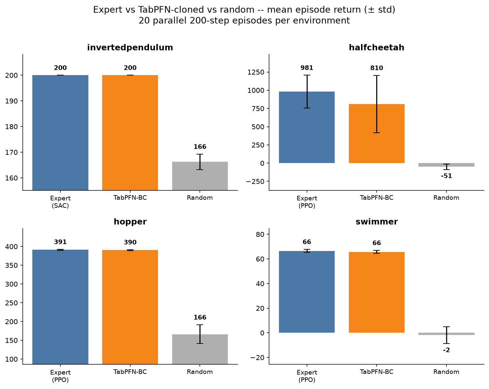</p>

### Atari (discrete actions, CNN-embedding states)

| Game | Actions | Offline accuracy (majority baseline) | TabPFN-BC / Expert |
| --- | --- | --- | --- |
| pong | 6 | 0.920 (0.216) | 100% |
| mspacman | 9 | 0.954 (0.314) | 100% |
| spaceinvaders | 6 | 0.864 (0.284) | ~97% |
| breakout* | 4 | 0.942 (0.450) | ~7% |

\* Breakout is truncated at 2,500 steps, and its real average episode is about 5,745.

<p align="center">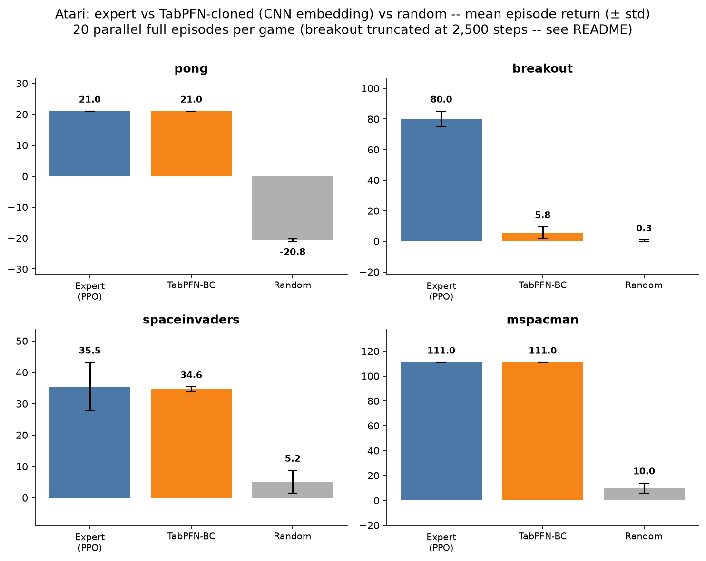</p>

### What we take from these results

- Cloning is close to perfect when the action space is small and gets worse as it grows. HalfCheetah (6 action dims) reaches 83 to 87%, and HumanoidStandup (17 action dims, 348 observation dims) drops to R² of about 0.34 offline.
- Breakout is the result we found most interesting, and it is a failure. At a 100-step horizon it looked like about 80% of the expert. On a full episode it fell to about 7%, even though it had the highest offline accuracy of the four games. This is the usual sign of compounding error in behavior cloning.
- That does not hold everywhere. HalfCheetah, which also has 6 action dims, reached 87.0% when run for a full 1,000-step episode, better than its 200-step number.

## Demo

<p align="center">
  <a href="https://youtu.be/lkEG4GceMvE">
    
  </a>
  <br>
  <a href="https://youtu.be/lkEG4GceMvE">
    
  </a>
</p>

A walkthrough of the project and of what happens in the code.

<table>
<tr>
<td align="center"><b>InvertedPendulum</b></td>
<td align="center"><b>HalfCheetah</b></td>
</tr>
<tr>
<td>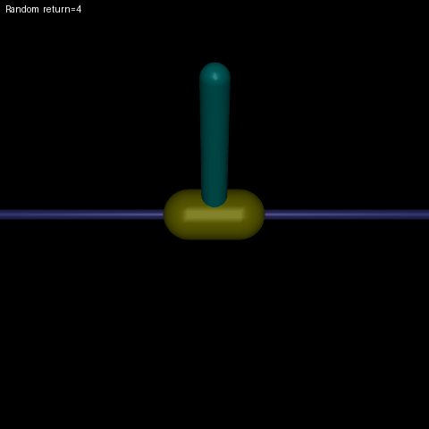 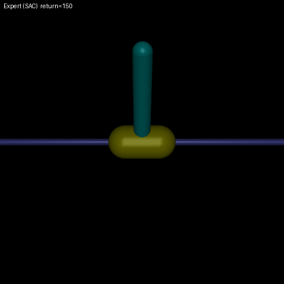 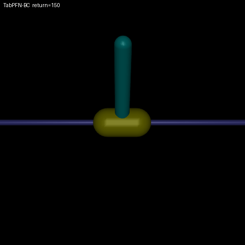</td>
<td>  </td>
</tr>
<tr>
<td align="center"><b>Hopper</b></td>
<td align="center"><b>Swimmer</b></td>
</tr>
<tr>
<td>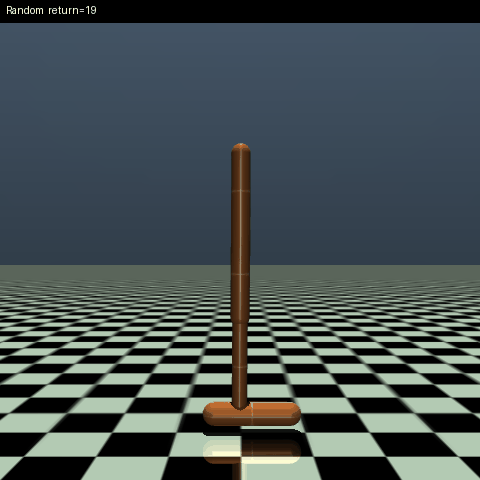 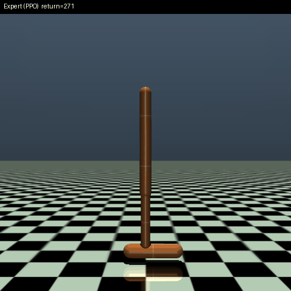 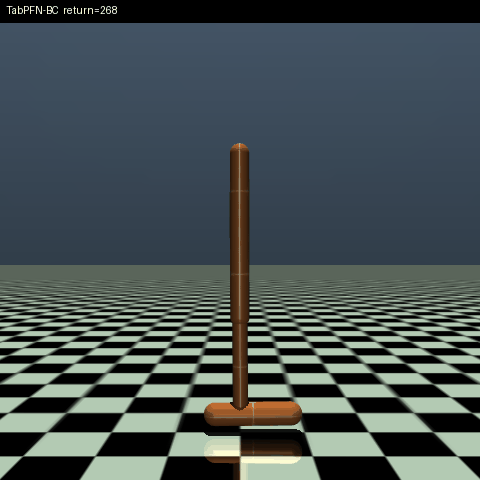</td>
<td>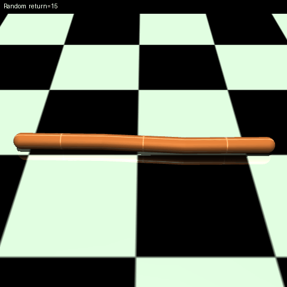 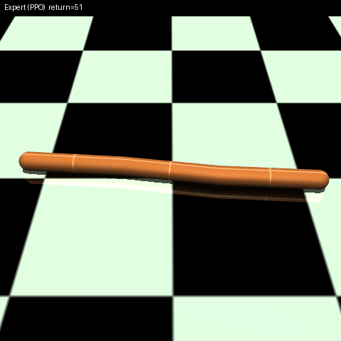 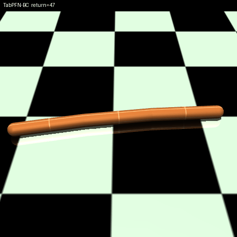</td>
</tr>
</table>

Each cell: Random, Expert, TabPFN-BC, in that order.

Atari:

<table>
<tr>
<td align="center"><b>Pong</b></td>
<td align="center"><b>Breakout</b></td>
</tr>
<tr>
<td>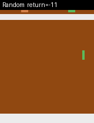 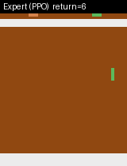 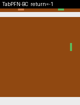</td>
<td>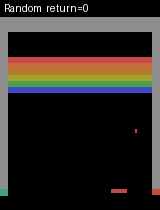 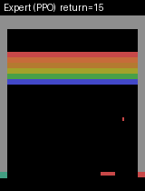 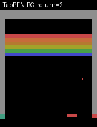</td>
</tr>
<tr>
<td align="center"><b>Space Invaders</b></td>
<td align="center"><b>Ms. Pac-Man</b></td>
</tr>
<tr>
<td>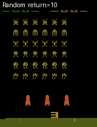 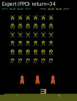 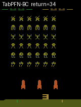</td>
<td>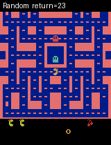 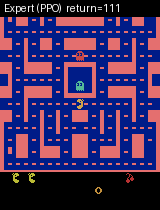 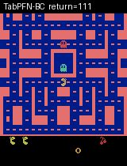</td>
</tr>
</table>

## Running the experiments

Every script takes `--env` (`invertedpendulum`, `halfcheetah`, `hopper`, `walker2d`, `swimmer` or `humanoidstandup`).

```bash
uv run python scripts/tabpfn_bc.py --env halfcheetah                  # offline R² / MSE check, about 3 min
uv run python scripts/evaluate_policies.py --env halfcheetah          # closed-loop comparison, about 10-15 min
uv run python scripts/record_comparison_video.py --env halfcheetah    # side-by-side GIFs, about 7-8 min
uv run python scripts/split_and_render_gifs.py --env halfcheetah
uv run python scripts/make_summary_grid.py                            # results grid from saved data
```

For Atari, one script runs all four games end to end (about 4 to 4.5 hours, most of it Breakout's truncated run):

```bash
./scripts/run_all_atari.sh
```

Step-by-step commands with timings and a file-by-file script reference are in [`docs/DETAILS.md`](docs/DETAILS.md).

## Limitations and next steps

- We clone from the expert's logged actions. Inferring actions from state trajectories alone (for example with an inverse dynamics model) is the harder setting and a natural next step.
- On Atari, TabPFN still depends on the expert's own CNN at evaluation time, so it is not yet an independent vision-to-action policy.
- Breakout's compounding error is the main open problem. DAgger-style re-labeling is the standard fix, and TabPFN's cheap `.fit()` makes it practical to try. Another idea is to use TabPFN's own predictive uncertainty to decide when to query the expert.
- `ant` is disabled, and `walker2d` and the walking Humanoid checkpoint fall almost immediately on the current MuJoCo engine. The cause is a physics difference from the 2022 mujoco-py setup they were trained on, not a bug in this code. See [`docs/DETAILS.md`](docs/DETAILS.md).

## Related work, and where it points next

Breakout's failure mode is a policy drifting into states it has no good
answer for, exactly the situation
[Monteiro et al.](https://arxiv.org/pdf/2606.16995) (When to ASK:
Uncertainty-Gated Language Assistance for Reinforcement Learning),
[Monteiro et al.](https://arxiv.org/pdf/2607.02686) (ASK in the Dark:
Uncertainty-Gated LLM Assistance under Partial Observability), and
[Gavenski et al.](https://arxiv.org/pdf/2604.02226) (When in Doubt, Plan
It Out: Committed Small Language Model Deliberation for Reactive
Reinforcement Learning) target with uncertainty-gated assistance: don't
lean on an external model at every step, only when the agent's own
confidence says to. Those papers gate a *language* model's help into an
RL agent; the mechanism, not the modality, is the useful borrow here.
TabPFN-BC currently trusts every prediction equally for the whole
episode. A natural next step for the DAgger-style fix mentioned above:
gate on TabPFN's own predictive uncertainty, and only fall back to
querying the expert (adding that state to the context) when confidence
drops, instead of re-labeling on a fixed schedule.

## Acknowledgements

Thanks to [Prior Labs](https://priorlabs.ai) for TabPFN-3.5 and the hackathon,
and to Instituto Kunumi for the resources.

## Citation

```bibtex
@misc{monteiro2026tabpfnbc,
    author = {Monteiro, Juarez and Lima, Clarissa and Paulo, Lu{\'i}s and Galuppo, Francisco},
    title  = {TabPFN-3.5 as a Behavior-Cloned Policy for Control (MuJoCo and Atari)},
    year   = {2026},
    url    = {https://github.com/jrzmnt/tabpfn-hackathon}
}
```

Released under the [Apache License 2.0](LICENSE).
